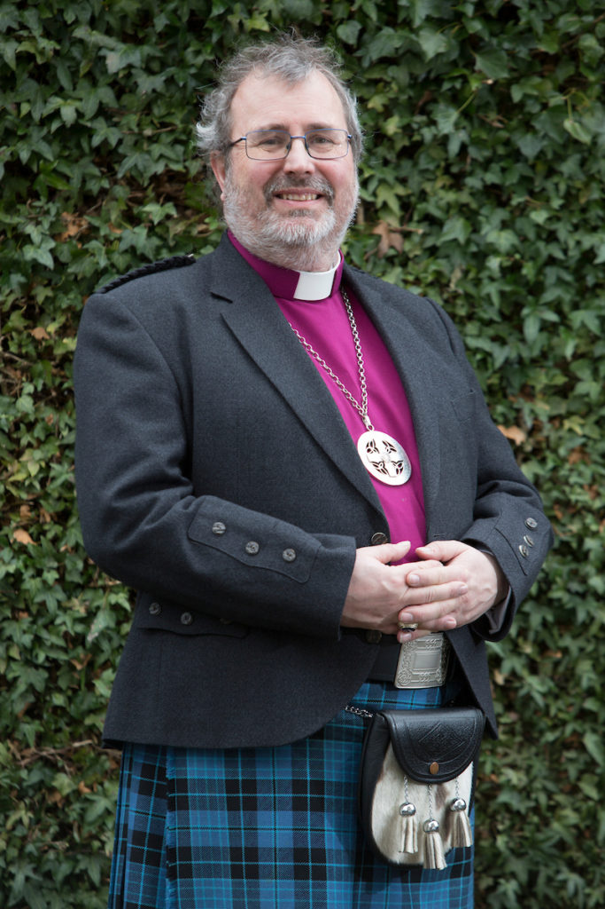

  
  Communities across the world are living with the devastating impacts as changes take place in the environment around them, with those least responsible for the climate and ecological crises being affected the most. Food becomes harder to produce, sea levels rise and drought hits - to name just a few of these impacts; these are not imagined threats of the future, these are things happening now to our brothers and sisters across the world. As part of God's creation and as part of the body of Christ we have a responsibility not only for what happens on our doorstep but also for what happens to the whole of God's Creation.

The Scottish Episcopal Church, along with partner churches and environmental groups, has committed to achieve net zero carbon emissions by 2030, to help limit the changes to the environment and to begin to restore the balance in Creation.

The Net Zero Toolkit was first launched in 2022, and will be updated with new resources and materials as they become available. The Net Zero Action Plan, launched in 2023, is a complementary document which sets out the overall policy and strategy of the SEC, enabling and guiding the actions and steps put forward in the NZ Toolkit.  

The Net Zero Toolkit being offered here is the latest version, launched in 2023, containing updated material and resources as well as continuing material from the 2022 version.  It is offered as the first place for charges and dioceses to look for guidance on the actions they can take in their buildings and congregational life, now and over the years leading up to 2030. People are often anxious about what they can do and how to get started, and the resources and materials in this NZ Toolkit offer us a roadmap we can begin to follow.

The College of Bishops commends the Net Zero Toolkit to all the dioceses, charges, congregations, and individual members of the Scottish Episcopal Church, and asks you all to engage with the Toolkit without delay and begin to make real change now.

People of faith are also people of hope, we believe in the hope of salvation, the hope of God's love and care for us and for this planet. Difficult as some of the changes may be, they are also signs of hope, each step on the road will bring hope to ourselves, to others, and to all of God's Creation

_The Most Rev Mark Strange, Primus_

