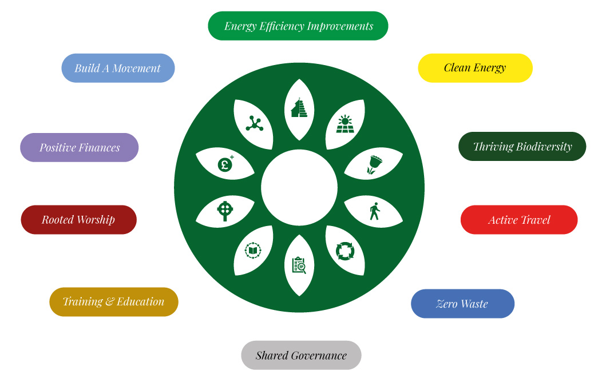

Thank you for your interest in our Net Zero Toolkit Cards.

Each card relates to one task in the Provincial Environment Group's Net Zero Toolkit.  Completing the task means developing a considered view of each card associated with that task and acting on the ones that will help your congregation reach net zero.

Read "How to Use the Cards" first, and then explore your actions.

{: .note }

> This website it still in preparation, but it gives you a sense of what it will contain.
> 
> - it is only filled out for the first two task areas, or "petals"
> - very few cards have any further information linked to them
> - everything is still under review - this is a first draft 
> - we are still discussing the correct tags (magic wands, quick wins, and so on) to put on the cards and what things "count"

