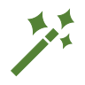

---
title: Magic Wands
layout: plain
nav_order: 2.4
parent: How to Use the Cards
--- 

If you feel stuck, it might help to look back at the magic wand cards.  These are the ones that can be real game-changers because they make a big change from "business as usual." 

      Magic wand cards:
       
      <ul>
      
          
          <li><a href="{{ card.url }}">{{ card.title }} </a></li>
          
      </ul>

