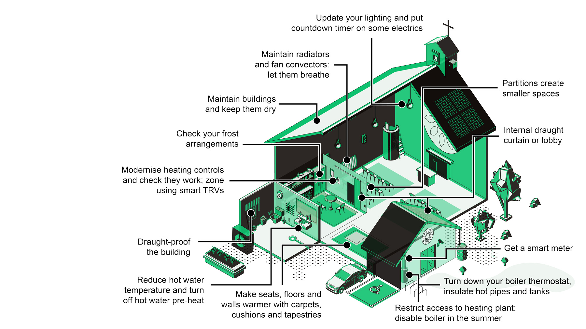

---
title: Quick Wins
layout: home
nav_order: 2.3
parent: How to Use the Cards
--- 

There are a number of actions that we consider to be quick wins - things that might be relatively easy to do and immediately reduce your energy bill.  

{: .note }
The selection of quick wins is still under review. We intend to indicate quick wins on this website with a special tag so you can find them quickly.